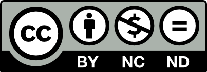

This is the repository of the short course on **Uncertainty Quantification for Computational Predictive Science**, taught by Prof. Americo Cunha Jr (LNCC & UERJ) at the University of Trento in January 2026.

Slides of lectures, references, and codes used in the computational activities are available here.

Video lectures (in English) are available on YouTube:

Day 1:
https://www.youtube.com/live/e6uP44IHxoQ?si=BumG1jI4gOKVRkl6

Day 2:
https://www.youtube.com/live/YXfSHBuJfAM?si=nuCrjTXT14vk5NaN

Day 3:
https://www.youtube.com/live/wy5AHz2rwps?si=1DSFomsxewhx4BYp

Day 4:
https://www.youtube.com/live/yaXLdkRm55s?si=S8O5Kztq7glFb3aJ

## License

This course material may be shared under the terms of Creative Commons BY-NC-ND 4.0 license, for educational purposes only.

